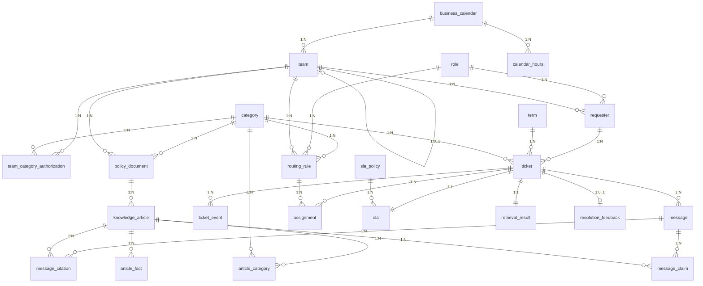

# Entity-relationship diagram

```mermaid
erDiagram
    role ||--o{ requester : "1:N"
    team ||--o{ requester : "1:N"
    business_calendar ||--o{ calendar_hours : "1:N"
    business_calendar ||--o{ team : "1:N"
    team ||--o| team : "1:0..1"
    team ||--o{ team_category_authorization : "1:N"
    category ||--o{ team_category_authorization : "1:N"
    category ||--o{ routing_rule : "1:N"
    role ||--o{ routing_rule : "1:N"
    team ||--o{ routing_rule : "1:N"
    category ||--o{ policy_document : "1:N"
    team ||--o{ policy_document : "1:N"
    policy_document ||--o{ knowledge_article : "1:N"
    knowledge_article ||--o{ article_fact : "1:N"
    knowledge_article ||--o{ article_category : "1:N"
    category ||--o{ article_category : "1:N"
    requester ||--o{ ticket : "1:N"
    term ||--o{ ticket : "1:N"
    category ||--o{ ticket : "1:N"
    ticket ||--o{ ticket_event : "1:N"
    ticket ||--o{ message : "1:N"
    ticket ||--o{ assignment : "1:N"
    ticket ||--|| sla : "1:1"
    sla_policy ||--o{ sla : "1:N"
    ticket ||--|| retrieval_result : "1:1"
    ticket ||--o| resolution_feedback : "1:0..1"
    message ||--o{ message_citation : "1:N"
    knowledge_article ||--o{ message_citation : "1:N"
    message ||--o{ message_claim : "1:N"
    knowledge_article ||--o{ message_claim : "1:N"
    routing_rule ||--o{ assignment : "1:N"
```
